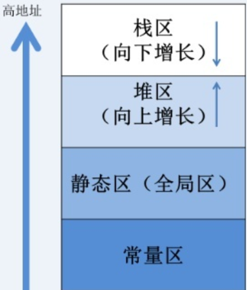

# stl初探

- [stl初探](#stl初探)
  - [日记一:萃取与元编程](#日记一萃取与元编程)
  - [日记二:static与模板](#日记二static与模板)
  - [日记三:模板与头文件](#日记三模板与头文件)
  - [日记四:bat文件的编写](#日记四bat文件的编写)
    - [bat文件的特殊字符](#bat文件的特殊字符)
    - [bat文件中的变量](#bat文件中的变量)

## 日记一:萃取与元编程

- stl中的元编程十分丰富
  - 使用c++模板的偏特化以及SFINAE特性,stl实现了大量元编程模型;ms版本的实现包含在\<xtr1common\>文件中
    - 类的萃取(比如最常见的iterator_traits)
    - 编译时的bool表达式(conditional,is_same)
    - 类型的转化(remove_const,remove_volatile,remove_reference)
    - 基于模板参数包语法特性的N选1(或运算:disjunction_v)
- 一点基础知识:
  - 1.偏特化模板匹配的优先顺序:按照不确定性进行匹配
    - template\<class a,class b\>偏特化为template\<bool a,class b\>或者template\<false,class b\>
    - 在可能的情况下template\<false,class b\>更为优先,因为它的不确定性为1,其次是不确定性为2的template\<bool a,class b\>
  - 2.模板参数包:压缩包-展开包

- coditional_t的实现:
  - 使用conditional\<false, _Ty1, _Ty2\>,通过偏特化达到if-else的效果

```c++
template <bool _Test, class _Ty1, class _Ty2>
struct conditional { // Choose _Ty1 if _Test is true, and _Ty2 otherwise
    using type = _Ty1;
};

template <class _Ty1, class _Ty2>
struct conditional<false, _Ty1, _Ty2> {
    using type = _Ty2;
};

template <bool _Test, class _Ty1, class _Ty2>
using conditional_t = typename conditional<_Test, _Ty1, _Ty2>::type;
```

- remove_const的实现:
  - 使用\<const _Ty\>,通过偏特化去掉const修饰符

```c++
//去除顶层const
template <class _Ty>
struct remove_const { 
    using type = _Ty;
};

template <class _Ty>
struct remove_const<const _Ty> {
    using type = _Ty;
};

template <class _Ty>
using remove_const_t = typename remove_const<_Ty>::type;
```

- disjunction的实现:
  - 递归展开模板参数包,优先适配\<false, _False, _Next, _Rest...\>,只有在true或者不存在_Next的时候,优先适配\<bool _First_value, class _First, class... _Rest\>

```c++
// STRUCT TEMPLATE disjunction
template <bool _First_value, class _First, class... _Rest>
struct _Disjunction { // handle true trait or last trait
    using type = _First;
};

template <class _False, class _Next, class... _Rest>
struct _Disjunction<false, _False, _Next, _Rest...> { // first trait is false, try the next trait
    using type = typename _Disjunction<_Next::value, _Next, _Rest...>::type;
};

template <class... _Traits>
struct disjunction : false_type {}; // If _Traits is empty, false_type

template <class _First, class... _Rest>
struct disjunction<_First, _Rest...> : _Disjunction<_First::value, _First, _Rest...>::type {
    // the first true trait in _Traits, or the last trait if none are true
};

template <class... _Traits>
_INLINE_VAR constexpr bool disjunction_v = disjunction<_Traits...>::value;

// VARIABLE TEMPLATE _Is_any_of_v
template <class _Ty, class... _Types>
_INLINE_VAR constexpr bool _Is_any_of_v = // true if and only if _Ty is in _Types
    disjunction_v<is_same<_Ty, _Types>...>;
```

## 日记二:static与模板

- 模板可以看做是一种静态的泛型编程模式,它所需要的模板参数分为两种:
  - 类型模板参数:一般是一个类型的名字.或者某种内置变量类型名字.
  - 非类型模板参数:一般是一个常量,比如数字和布尔值等,或者是指针类型.
- 非类型模板参数的限制:
  - 模板是一种静态的泛型机制,因此在编译器推导模板之前,所有的非类型模板参数必须被初始化
  - c++限制非类型模板参数的类别,不能是一个类,只能是内置数据类型或者是指针类型.
  - 当选择指针类型(比如class A的引用 A&)时,可以正常声明这样的一个模板(template\<A& obj_ref\> tem_B).

  ```c++
  class A{// ...};
  
  template<int param1,A& param2> tem_B{// ...};
  ```

  - 具有非内置指针类型的模板,在模板实例化的时候必须用static变量实例化.

  ```c++
  class A{// ...};

  template<int param1,A& param2> tem_B{// ...};

  int main()
  {
    static A a_obj();
    // 必须使用静态变量来实例化模板
    tem_B<100,a_obj> b_obj();
  }
  ```

- 一个计算机程序的内存映射:

  

## 日记三:模板与头文件

- 非模板类的hpp与cpp文件:
  - 可以将声明写入hpp文件中,类的实现写在cpp文件中
  - 对于使用该类的客户代码,需要:
    - 在编译的时候将main.cpp 和cpp文件一同编译
    - 在main.cpp中include hpp文件
- 模板类不能效仿非模板类:
  - 如果使用hpp与cpp文件相分离的编写方式会导致链接时出现"无法解析的外部符号"
  - 如果还想要使用hpp与cpp文件相分离的编写方式,必须要在main.cpp中同时include两者

## 日记四:bat文件的编写

### bat文件的特殊字符

- <, >, |, &,^ 都是bat文件中的特殊字符
- 包含特殊字符的字符串需要使用双引号包裹

### bat文件中的变量

- set-环境变量
  - 命令:set \<variable-name\>=\<variable_value\>
  - 注意:该命令中的等号左右不能有空格
  - 访问set变量的两种方法
    - 非延迟访问: %\<variable-name\>%
    - 延迟访问:   !\<variable-name\>!

- 系统环境变量
  - 基本与set-环境变量一致:
  - 然而系统环境变量的值被系统保存,bat文件使用set只能暂时更改
    - 命令:set \<variable-name\>=\<variable_value\>
    - 注意:该命令中的等号左右不能有空格
    - 访问set变量的两种方法
      - 非延迟访问: %\<variable-name\>%
      - 延迟访问:   !\<variable-name\>!

```bat
@echo off
set /a var=10
echo %var%

@REM 开启shell的延迟变量选项
setlocal EnableDelayedExpansion

@REM 在该bat文件中暂时将系统环境变量errorlevel设定为0
set errorlevel=0

@REM 延迟访问变量
set control=!errorlevel!
if !control!==0 (
  set /a var=20
  echo %var% 
  @REM echo的值永远是初始值10
  echo !var!
  @REM 延迟访问的值可能是10或者20
)
@REM 输出依次为 10 10 20 
```
